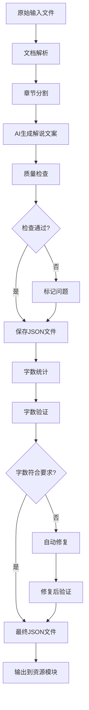

# Narration模块设计文档

## 1. 模块概述

### 1.1 功能定位

Narration模块负责将原始输入（小说、文档、图片等）转换为可用于视频制作的解说文案（narration）。该模块是工作流系统的核心模块之一，为后续的分镜生成、视频制作等阶段提供标准化的解说文案。

### 1.2 核心特性

- **多格式输入支持**: 支持TXT、Word、PDF、图片（OCR）等多种输入格式
- **AI驱动生成**: 使用Gemini3 Pro、豆包等AI服务生成高质量解说文案
- **质量保证**: 内置完整性、格式、连贯性检查机制
- **自动修复**: 支持字数验证和自动修复功能
- **JSON格式**: 使用JSON格式存储，便于处理和扩展
- **章节化处理**: 支持按章节分割和处理大型文档

### 1.3 与其他模块的关系

```
资源模块（Resource Module）
    ↓ (提供输入文件)
Narration模块
    ↓ (生成解说文案JSON)
分镜生成模块（Storyboard Module）
视频生成模块（Video Module）
```

## 2. 流程设计

Narration模块包含两个核心步骤：

1. **生成解说文案（带检查）**: 将原始输入转换为解说文案，并进行质量检查
2. **验证解说文案字数（自动修复）**: 验证字数是否符合要求，并自动修复不符合要求的部分

### 2.1 整体流程图



## 3. 步骤1: 生成解说文案（带检查）

### 3.1 功能描述

根据输入文本生成解说文案，并在生成过程中进行质量检查。

### 3.2 输入准备

- **输入来源**: 资源模块提供的文件资源ID
- **输入文件类型**: 
  - TXT文本文件
  - Word文档 (.doc, .docx)
  - PDF文档
  - 图片文件（OCR识别）

### 3.3 详细处理流程

#### 3.3.1 文档解析阶段

1. **资源获取**:
   - 从资源模块获取文件资源
   - 验证文件存在性和访问权限
   - 下载文件到临时目录（如需要）

2. **文件识别**: 
   - 根据文件扩展名和MIME类型识别文件类型
   - 验证文件格式是否支持

3. **内容提取**:
   - **TXT**: 直接读取文本内容
   - **Word**: 使用文档解析库提取文本和格式
   - **PDF**: 使用PDF解析库提取文本内容
   - **图片**: 使用OCR技术识别文本内容

4. **编码处理**: 
   - 统一转换为UTF-8编码
   - 处理BOM标记

5. **文本清理**: 
   - 去除特殊字符、多余空白
   - 规范化换行符
   - 去除控制字符

#### 3.3.2 章节分割阶段

1. **章节识别**: 
   - 识别章节标题（如"第一章"、"Chapter 1"、"第X章"等）
   - 识别章节分隔符（空行、特殊标记等）
   - 支持多种章节格式

2. **章节分割**: 
   - 将文档按章节分割成多个独立单元
   - 保留章节标题和内容

3. **章节元数据**: 
   - 记录每个章节的标题、起始位置、长度等信息
   - 生成章节ID和序号

#### 3.3.3 AI生成阶段

1. **Prompt构建**: 
   - 为每个章节构建生成Prompt
   - 包含章节内容、生成要求、格式规范等
   - 示例Prompt:
     ```
     请将以下章节内容转换为视频解说文案，要求：
     1. 每个分镜包含场景描述、解说文案、景别信息
     2. 解说文案要生动有趣，适合视频配音
     3. 景别包括：close-up（特写）、medium（中景）、wide（全景）
     
     章节内容：
     {章节内容}
     ```

2. **AI服务调用**:
   - 支持的AI服务: Gemini3 Pro、豆包等
   - 调用AI服务的文本生成接口
   - 传递章节内容和生成参数
   - 处理API限流和重试

3. **分镜脚本生成**:
   - 将章节内容转换为分镜脚本
   - 每个分镜包含:
     - 分镜ID（唯一标识）
     - 分镜序号（sequence）
     - 场景描述（scene）
     - 解说文案（narration）
     - 台词（dialogue，可选）
     - 景别信息（shot_type: close-up/medium/wide等）

4. **批量处理**: 
   - 对多个章节进行批量生成
   - 支持并发处理（控制并发数）
   - 处理失败重试机制

#### 3.3.4 质量检查阶段

在生成过程中进行实时质量检查：

1. **完整性检查**:
   - 检查每个分镜是否都有解说文案
   - 检查章节是否完整生成
   - 检查是否有遗漏的分镜
   - 检查分镜序号是否连续

2. **格式规范性检查**:
   - 检查JSON格式是否正确
   - 检查必需字段是否都存在
   - 检查数据结构是否符合规范
   - 验证字段类型和值范围

3. **内容连贯性检查**:
   - 检查分镜之间的逻辑连贯性
   - 检查场景转换是否合理
   - 检查文案风格是否统一
   - 检查是否有重复内容

4. **问题标记**:
   - 标记不符合要求的分镜
   - 记录检查结果和问题描述
   - 生成问题报告

#### 3.3.5 输出保存阶段

1. **JSON文件生成**:
   - 将生成的解说文案保存为JSON格式
   - 文件路径: 通过资源模块保存
   - JSON结构（见第5节详细定义）

2. **日志和报告生成**:
   - 生成日志文件: 记录处理过程
   - 生成检查报告: JSON格式，包含:
     - 生成统计（章节数、分镜数等）
     - 检查结果汇总
     - 问题列表和位置
     - 处理时间统计

### 3.4 错误处理

- **生成失败**: 
  - 记录错误信息到日志
  - 标记失败的章节
  - 支持重试机制（最多3次）
  - 记录失败原因

- **检查失败**: 
  - 记录问题到报告
  - 标记需要修复的分镜
  - 继续处理其他分镜
  - 生成问题汇总

### 3.5 输出结果

- ✅ 解说文案JSON文件（初稿）
- ✅ 生成日志文件
- ✅ 质量检查报告（JSON格式）

## 4. 步骤2: 验证解说文案字数（自动修复）

### 4.1 功能描述

验证生成的解说文案字数是否符合要求，并在启用自动修复时自动修复不符合要求的部分。

### 4.2 输入准备

- **输入来源**: 步骤1生成的解说文案JSON文件（通过资源模块获取）
- **参数选项**:
  - `auto_fix`: 是否启用自动修复功能（默认: false）
  - `min_words`: 最小字数要求（默认: 20字）
  - `max_words`: 最大字数要求（默认: 100字）
  - `recommended_min`: 推荐最小字数（默认: 40字）
  - `recommended_max`: 推荐最大字数（默认: 60字）

### 4.3 详细处理流程

#### 4.3.1 字数统计阶段

1. **JSON文件解析**:
   - 从资源模块获取JSON文件
   - 解析JSON结构，提取所有分镜的解说文案
   - 验证JSON格式正确性

2. **字数统计**:
   - 对每个分镜的解说文案进行字数统计
   - 统计方式:
     - 中文字符: 每个字符计1字
     - 英文单词: 每个单词计1字（空格分隔）
     - 标点符号: 不计入字数
     - 数字: 每个数字计1字
   - 记录统计结果到内存结构

#### 4.3.2 字数验证阶段

1. **规则定义**:
   - 默认规则:
     - 最小字数: 20字（可配置）
     - 最大字数: 100字（可配置）
     - 推荐字数: 40-60字
   - 自定义规则: 可通过API参数或配置文件指定

2. **验证检查**:
   - 遍历所有分镜，检查每个分镜的字数
   - 分类标记:
     - ✅ **符合要求**: 字数在合理范围内（20-100字）
     - ⚠️ **字数过少**: 字数 < 最小字数要求（20字）
     - ⚠️ **字数过多**: 字数 > 最大字数要求（100字）
     - ❌ **严重异常**: 字数 = 0 或字数 > 200

3. **问题汇总**:
   - 统计不符合要求的分镜数量
   - 按问题类型分类（过少/过多）
   - 记录问题分镜的位置和详情

#### 4.3.3 自动修复阶段（启用 `auto_fix` 时）

##### 4.3.3.1 字数过多的修复

1. **问题识别**: 找出字数 > 最大字数要求的分镜

2. **AI改写**:
   - 调用AI服务（Gemini3 Pro、豆包等）
   - 构建改写Prompt:
     ```
     请将以下解说文案精简到{目标字数}字以内，保持核心信息和语义完整，风格保持一致：
     
     原始文案：
     {原始文案}
     
     上下文（前一个分镜）：
     {前一个分镜的文案}
     
     上下文（后一个分镜）：
     {后一个分镜的文案}
     ```
   - 获取改写后的文案

3. **质量检查**:
   - 检查改写后的字数是否符合要求
   - 检查语义是否保持完整
   - 检查风格是否一致
   - 检查与上下文的连贯性

4. **替换更新**: 将改写后的文案替换原文案

##### 4.3.3.2 字数过少的修复

1. **问题识别**: 找出字数 < 最小字数要求的分镜

2. **AI补充**:
   - 调用AI服务
   - 构建补充Prompt:
     ```
     请将以下解说文案补充到至少{最小字数}字，保持语义完整和风格一致：
     
     原始文案：
     {原始文案}
     
     上下文（前一个分镜）：
     {前一个分镜的文案}
     
     上下文（后一个分镜）：
     {后一个分镜的文案}
     
     场景描述：
     {场景描述}
     ```
   - 获取补充后的文案

3. **质量检查**:
   - 检查补充后的字数是否符合要求
   - 检查补充内容是否合理
   - 检查是否与上下文连贯
   - 检查是否与场景描述匹配

4. **替换更新**: 将补充后的文案替换原文案

##### 4.3.3.3 修复后验证

1. **重新统计**: 对修复后的文案重新进行字数统计

2. **二次验证**: 再次检查字数是否符合要求

3. **修复记录**: 记录修复前后的对比
   ```json
   {
     "shot_id": "shot_1",
     "chapter_id": "chapter_1",
     "before": {
       "word_count": 120,
       "status": "too_long",
       "narration": "原始文案..."
     },
     "after": {
       "word_count": 58,
       "status": "valid",
       "narration": "修复后文案..."
     },
     "fixed": true,
     "fix_type": "shorten",
     "fixed_at": "2024-01-01T12:00:00Z"
   }
   ```

#### 4.3.4 验证报告生成

1. **报告内容**:
   - 总体统计:
     - 总分镜数
     - 符合要求的分镜数
     - 不符合要求的分镜数（修复前/修复后）
     - 修复成功数/失败数
   - 详细列表:
     - 每个分镜的字数统计
     - 问题分镜的详情
     - 修复记录（如果启用自动修复）
   - 建议:
     - 需要人工检查的分镜
     - 可能需要重新生成的分镜

2. **报告格式**:
   - JSON格式: 通过资源模块保存
   - 包含完整的统计和修复信息

#### 4.3.5 文件更新

1. **JSON文件更新**:
   - 如果启用自动修复，更新原始JSON文件
   - 备份原文件: 通过资源模块保存备份
   - 保存修复后的文件: 更新原文件或创建新版本

2. **元数据更新**:
   - 更新分镜的字数信息
   - 标记修复状态
   - 记录修复时间

### 4.4 错误处理

- **验证失败**: 
  - 记录验证错误到日志
  - 标记无法验证的分镜
  - 继续处理其他分镜

- **修复失败**: 
  - 记录修复失败的分镜
  - 标记为需要人工处理
  - 保留原始文案
  - 记录失败原因

### 4.5 输出结果

- ✅ 验证报告（JSON格式）
- ✅ 修复后的解说文案JSON文件（如果启用自动修复）
- ✅ 修复记录和对比数据

## 5. JSON格式定义

### 5.1 解说文案JSON结构

```json
{
  "version": "1.0",
  "workflow_id": "workflow_001",
  "resource_id": "resource_001",
  "metadata": {
    "title": "小说标题",
    "author": "作者名",
    "generated_at": "2024-01-01T10:00:00Z",
    "generated_by": "narration_service",
    "ai_provider": "gemini",
    "ai_model": "gemini-3-pro",
    "total_chapters": 10,
    "total_shots": 150,
    "status": "completed"
  },
  "chapters": [
    {
      "id": "chapter_1",
      "sequence": 1,
      "title": "第一章",
      "metadata": {
        "original_title": "第一章 开始",
        "word_count": 5000,
        "shot_count": 15
      },
      "shots": [
        {
          "id": "shot_1",
          "sequence": 1,
          "scene": "场景描述：一个安静的图书馆，阳光透过窗户洒在书桌上",
          "narration": "在这个安静的图书馆里，时间仿佛静止了。阳光透过窗户，在书桌上投下斑驳的光影。",
          "dialogue": null,
          "shot_type": "wide",
          "metadata": {
            "word_count": 45,
            "duration_estimate": 3.5,
            "status": "valid",
            "validated_at": "2024-01-01T10:05:00Z"
          }
        },
        {
          "id": "shot_2",
          "sequence": 2,
          "scene": "场景描述：特写镜头，聚焦在一本翻开的书上",
          "narration": "书页上密密麻麻的文字，记录着古老的故事。",
          "dialogue": null,
          "shot_type": "close-up",
          "metadata": {
            "word_count": 18,
            "duration_estimate": 2.0,
            "status": "too_short",
            "validated_at": "2024-01-01T10:05:00Z",
            "fixed": true,
            "fix_type": "expand"
          }
        }
      ]
    }
  ],
  "validation_report": {
    "validated_at": "2024-01-01T10:10:00Z",
    "total_shots": 150,
    "valid_shots": 145,
    "invalid_shots": 5,
    "fixed_shots": 5,
    "failed_shots": 0,
    "statistics": {
      "min_words": 20,
      "max_words": 100,
      "average_words": 52,
      "median_words": 48
    }
  }
}
```

### 5.2 字段说明

#### 5.2.1 根级别字段

- `version`: JSON格式版本号（字符串）
- `workflow_id`: 所属工作流ID（字符串）
- `resource_id`: 关联的资源ID（字符串，指向输入文件资源）
- `metadata`: 元数据对象
- `chapters`: 章节数组
- `validation_report`: 验证报告（可选，在验证后添加）

#### 5.2.2 Chapter（章节）字段

- `id`: 章节唯一标识（字符串）
- `sequence`: 章节序号（整数，从1开始）
- `title`: 章节标题（字符串）
- `metadata`: 章节元数据对象
- `shots`: 分镜数组

#### 5.2.3 Shot（分镜）字段

- `id`: 分镜唯一标识（字符串）
- `sequence`: 分镜序号（整数，在章节内从1开始）
- `scene`: 场景描述（字符串）
- `narration`: 解说文案（字符串，必需）
- `dialogue`: 台词（字符串，可选，null表示无台词）
- `shot_type`: 景别类型（字符串，枚举值: "close-up", "medium", "wide"）
- `metadata`: 分镜元数据对象

#### 5.2.4 Shot Metadata字段

- `word_count`: 字数统计（整数）
- `duration_estimate`: 预估时长（秒，浮点数）
- `status`: 验证状态（字符串，枚举值: "valid", "too_short", "too_long", "invalid"）
- `validated_at`: 验证时间（ISO 8601格式字符串）
- `fixed`: 是否已修复（布尔值，可选）
- `fix_type`: 修复类型（字符串，可选，枚举值: "shorten", "expand"）

### 5.3 数据验证规则

1. **必需字段**: `version`, `workflow_id`, `chapters` 为必需字段
2. **章节顺序**: `chapters` 数组中的章节必须按 `sequence` 字段排序
3. **分镜顺序**: 每个章节的 `shots` 数组必须按 `sequence` 字段排序
4. **ID唯一性**: 所有章节ID和分镜ID必须在各自范围内唯一
5. **字数范围**: `narration` 字段的字数应在20-100字之间（验证后）

## 6. API接口设计

### 6.1 创建Narration生成任务

**POST** `/api/v1/workflow/narration/generate`

创建解说文案生成任务。

**请求体**:
```json
{
  "workflow_id": "workflow_001",
  "resource_id": "resource_001",
  "options": {
    "ai_provider": "gemini",
    "ai_model": "gemini-3-pro",
    "chapter_detection": "auto",
    "concurrent_chapters": 3
  }
}
```

**响应** (202 Accepted):
```json
{
  "code": 0,
  "message": "任务已创建",
  "data": {
    "task_id": "task_001",
    "workflow_id": "workflow_001",
    "status": "pending",
    "created_at": "2024-01-01T10:00:00Z"
  }
}
```

### 6.2 查询Narration生成结果

**GET** `/api/v1/workflow/narration/generate`

查询生成任务结果。

**查询参数**:
- `task_id`: 任务ID（必需）

**响应**:
```json
{
  "code": 0,
  "message": "success",
  "data": {
    "task_id": "task_001",
    "workflow_id": "workflow_001",
    "status": "completed",
    "resource_id": "resource_002",
    "result": {
      "total_chapters": 10,
      "total_shots": 150,
      "generated_at": "2024-01-01T10:05:00Z"
    },
    "created_at": "2024-01-01T10:00:00Z",
    "completed_at": "2024-01-01T10:05:00Z"
  }
}
```

### 6.3 创建Narration验证任务

**POST** `/api/v1/workflow/narration/validate`

创建解说文案验证任务。

**请求体**:
```json
{
  "workflow_id": "workflow_001",
  "resource_id": "resource_002",
  "options": {
    "auto_fix": true,
    "min_words": 20,
    "max_words": 100
  }
}
```

**响应** (202 Accepted):
```json
{
  "code": 0,
  "message": "验证任务已创建",
  "data": {
    "task_id": "task_002",
    "workflow_id": "workflow_001",
    "status": "pending",
    "created_at": "2024-01-01T10:10:00Z"
  }
}
```

### 6.4 查询Narration验证结果

**GET** `/api/v1/workflow/narration/validate`

查询验证任务结果。

**查询参数**:
- `task_id`: 任务ID（必需）

**响应**:
```json
{
  "code": 0,
  "message": "success",
  "data": {
    "task_id": "task_002",
    "workflow_id": "workflow_001",
    "status": "completed",
    "resource_id": "resource_003",
    "result": {
      "total_shots": 150,
      "valid_shots": 145,
      "invalid_shots": 5,
      "fixed_shots": 5,
      "validated_at": "2024-01-01T10:15:00Z"
    },
    "created_at": "2024-01-01T10:10:00Z",
    "completed_at": "2024-01-01T10:15:00Z"
  }
}
```

### 6.5 获取Narration JSON内容

**GET** `/api/v1/workflow/narration`

获取解说文案JSON内容。

**查询参数**:
- `workflow_id`: 工作流ID（必需）
- `resource_id`: 资源ID（可选，不提供则返回最新的）

**响应**:
```json
{
  "code": 0,
  "message": "success",
  "data": {
    "resource_id": "resource_003",
    "content": {
      "version": "1.0",
      "workflow_id": "workflow_001",
      "chapters": [...]
    }
  }
}
```

## 7. 数据模型

### 7.1 NarrationTask 实体

```go
// internal/model/narration/task.go
package narration

import (
    "time"
)

// NarrationTask 解说文案生成/验证任务
type NarrationTask struct {
    ID          string                 `bson:"id" json:"id"`
    WorkflowID  string                 `bson:"workflow_id" json:"workflow_id"`
    Type        TaskType                `bson:"type" json:"type"` // generate, validate
    InputResourceID  string            `bson:"input_resource_id" json:"input_resource_id"`
    OutputResourceID string            `bson:"output_resource_id,omitempty" json:"output_resource_id,omitempty"`
    Status      TaskStatus              `bson:"status" json:"status"`
    Options     map[string]interface{}  `bson:"options,omitempty" json:"options,omitempty"`
    Result      *TaskResult             `bson:"result,omitempty" json:"result,omitempty"`
    Error       string                  `bson:"error,omitempty" json:"error,omitempty"`
    CreatedAt   time.Time               `bson:"created_at" json:"created_at"`
    StartedAt   *time.Time              `bson:"started_at,omitempty" json:"started_at,omitempty"`
    CompletedAt *time.Time             `bson:"completed_at,omitempty" json:"completed_at,omitempty"`
}

// TaskType 任务类型
type TaskType string

const (
    TaskTypeGenerate TaskType = "generate" // 生成任务
    TaskTypeValidate TaskType = "validate" // 验证任务
)

// TaskStatus 任务状态
type TaskStatus string

const (
    TaskStatusPending   TaskStatus = "pending"   // 待处理
    TaskStatusRunning   TaskStatus = "running"   // 处理中
    TaskStatusCompleted TaskStatus = "completed" // 已完成
    TaskStatusFailed    TaskStatus = "failed"    // 失败
)

// TaskResult 任务结果
type TaskResult struct {
    TotalChapters int       `json:"total_chapters"`
    TotalShots    int       `json:"total_shots"`
    ValidShots    int       `json:"valid_shots,omitempty"`
    InvalidShots  int       `json:"invalid_shots,omitempty"`
    FixedShots    int       `json:"fixed_shots,omitempty"`
    CompletedAt   time.Time `json:"completed_at"`
}
```

## 8. 与资源模块的集成

### 8.1 输入文件获取

1. Narration模块通过资源ID从资源模块获取输入文件
2. 资源模块提供文件下载接口和临时访问URL
3. Narration模块处理完成后，将结果保存回资源模块

### 8.2 输出文件保存

1. 生成的JSON文件通过资源模块保存
2. 资源模块管理文件的存储、版本和访问控制
3. 支持文件备份和版本管理

### 8.3 资源关联

- 输入资源: 原始文件（TXT/Word/PDF/图片）
- 输出资源: 生成的JSON文件
- 日志资源: 生成日志和检查报告
- 备份资源: 修复前的备份文件

## 9. 错误处理和重试

### 9.1 错误分类

- **临时错误**: 网络超时、AI服务暂时不可用 → 自动重试（最多3次）
- **业务错误**: 文件格式不支持、内容解析失败 → 记录错误，不重试
- **系统错误**: 服务崩溃、数据损坏 → 告警，人工介入

### 9.2 重试策略

- **最大重试次数**: 3次
- **重试间隔**: 指数退避（1s, 2s, 4s）
- **重试条件**: 仅对临时错误重试

## 10. 性能优化

### 10.1 并发处理

- 支持多章节并发生成（可配置并发数）
- 控制AI服务调用频率，避免限流
- 使用任务队列处理长时间任务

### 10.2 缓存策略

- 缓存解析后的文档内容（短期）
- 缓存AI生成结果（如需要）
- 使用Redis缓存任务状态

## 11. 监控和日志

### 11.1 关键指标

- 任务创建数量
- 任务成功率
- 平均处理时间
- AI服务调用次数和成本
- 字数验证通过率

### 11.2 日志记录

- 任务状态变更
- 处理过程日志
- AI服务调用日志
- 错误详情
- 性能指标
